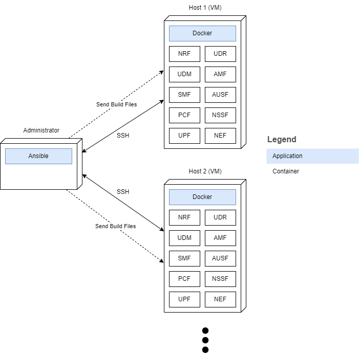

# Documentation
## Containerization and Deployment
This tool containerizes the following NFs with base image Ubuntu 16.04 using Docker and deploys them on the specified hosts using Ansible with the command `ansible-playbook -i test_hosts playbook.yml` where `test_hosts` is the inventory file with the group `test_hosts`:
- NRF
- UDR
- UDM
- AMF
- SMF
- AUSF
- NSSF
- UPF
- NEF
- PCF
	- AMF
	- NFRS
	- PES
	- OMS
	- IWS
	- SMS

Diagram of the process:

When the playbook is run again, if the latest image is built for a CNF, it is assumed that a container of that image exists and the said container is started again if it is exited. If the images are removed, the build and run process is repeated.

## Status and Port Testing
After deployment, services of all NFs are checked for activity. Later, the specified ports inside `build-run.sh` are exposed in their respective containers and tested for connection through the host machine. The results are reported in a playbook task.